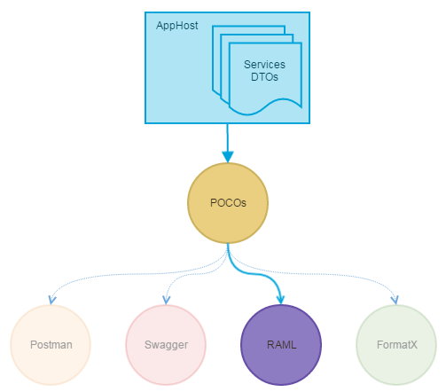

#  ServiceStack.IntroSpec.Raml
[](https://ci.appveyor.com/project/MacLeanElectrical/servicestack-introspec-raml/branch/master)
[](https://badge.fury.io/nu/ServiceStack.IntroSpec.raml)

A plugin for [ServiceStack](https://servicestack.net/) that uses output from [ServiceStack.IntroSpec](https://github.com/MacLeanElectrical/servicestack-introspec) 
to generate documentation that complies to the [RAML](http://raml.org/) standard.

---



The [ServiceStack.IntroSpec](https://github.com/MacLeanElectrical/servicestack-introspec) plugin uses introspection on a 
number of different sources to generate a set of universal documentation DTOs. ServiceStack.IntroSpec.Raml converts 
these DTOs to the [RAML 0.8](https://github.com/raml-org/raml-spec/blob/master/versions/raml-08/raml-08.md) specification.

[RAML](http://raml.org/about/about-raml) is a YAML-based specification for describing RESTful API's.

## Quick Start

Install the package [https://www.nuget.org/packages/ServiceStack.IntroSpec](https://www.nuget.org/packages/ServiceStack.IntroSpec.Raml/)
```bash
PM> Install-Package ServiceStack.IntroSpec.Raml
```

This plugin has a dependency on the [`ApiSpecFeature`](https://www.nuget.org/packages/ServiceStack.IntroSpec/) plugin from ServiceStack.IntroSpec 
but apart from that it is added like any other plugin.

```csharp
public override void Configure(Container container)
{
	// Dependency
	Plugins.Add(new ApiSpecFeature(....));
	
	// Register plugin
    Plugins.Add(new RamlFeature());
}
```

## Services

The plugin registers a service at `/spec/raml/0.8`. Calling this service will return output with content-type of `application/raml+yaml` 
that conforms to v0.8 of the RAML specification.

*Support for v1.0 will be added at a later date*

## Restrictions

There are a number of areas that are not yet completed, primarily due to data not yet being available via ServiceStack.IntroSpec. 

* Named Parameters - no support for Pattern, MinLength, MaxLength, Example or Default.
* Schemas are repeated and only rendered for JSON.
* No security information is output.
* Nested resources will all be rendered as main resources.

The output is valid when tested using the [RAML Api-Console](https://github.com/mulesoft/api-console). There are no 
'MUST' sections missing so the generated data should be usable in any RAML parser.